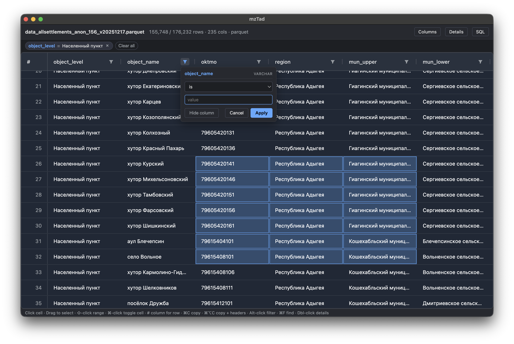

# mzTad


Fast desktop viewer for **CSV / TSV / JSON / Parquet** of any size, powered by DuckDB.
Designed for data investigations and quick exploration

Просмотрщик **CSV / TSV / JSON / Parquet** файлов любого размера с помощью DuckDB. Задуман для быстрого поиска и исследования данных



## Install

[mzTad](https://github.com/mediazona/mztad/releases) (macOS + Windows)

## Features

- Query files in place via DuckDB — no import step
- Virtualized grid with server-side sort, filter and pagination; scales to multi-GB files
- Per-column filter popover: `=`, `≠`, `contains`, `starts with`, ranges, null checks
- `⌘F` find — highlights matches with `<mark>`, jumps between them with `↵` / `⇧↵`
- Click-drag cell-range selection; `⌘C` / `⌘⌥C` copy to TSV (without / with headers)
- SQL editor for arbitrary queries on top of the loaded file
- Detail panel for inspecting struct / JSON values

## Develop

```bash
npm install
npm run dev
```

## Build for macOS

```bash
npm run dist:dir   # unsigned .app → release/mac-arm64/mzTad.app
npm run dist       # .dmg + .zip (arm64)
```

Unsigned builds trigger Gatekeeper on first launch — right-click → Open, or run `xattr -cr release/mac-arm64/mzTad.app`

## Build for Windows

```bash
npm run dist:win:dir   # unpacked → release/win-unpacked/mzTad.exe
npm run dist:win       # NSIS installer (.exe) + portable .zip (x64)
```

Run on a Windows machine (or via CI). Cross-building on macOS requires the Windows DuckDB binary — pre-fetch it once with `npm install --cpu=x64 --os=win32 --force @duckdb/node-bindings-win32-x64`.

## Credits

Slopped by **[Mediazona](https://zona.media)**

---


## Возможности

- Запрашивает файлы напрямую через DuckDB, без импорта
- Виртуализированная таблица с серверной сортировкой, фильтрацией и пагинацией; работает на многогигабайтных файлах
- Фильтры по колонкам: `=`, `≠`, `содержит`, `начинается с`, диапазоны, проверка на null
- `⌘F` — поиск по всем ячейкам, совпадения подсвечиваются `<mark>`, переход `↵` / `⇧↵`
- Выделение диапазона ячеек мышью; `⌘C` / `⌘⌥C` копируют TSV (без / с заголовками)
- SQL-редактор для произвольных запросов поверх загруженного файла
- Панель деталей для просмотра struct / JSON значений

## Разработка

```bash
npm install
npm run dev
```

## Сборка под macOS

```bash
npm run dist:dir   # неподписанный .app → release/mac-arm64/mzTad.app
npm run dist       # .dmg + .zip (arm64)
```

Неподписанные сборки при первом запуске блокирует Gatekeeper — правый клик → Открыть, или выполните `xattr -cr release/mac-arm64/mzTad.app`.

## Сборка под Windows

```bash
npm run dist:win:dir   # распакованная версия → release/win-unpacked/mzTad.exe
npm run dist:win       # NSIS-установщик (.exe) + portable .zip (x64)
```

Запускайте на Windows (или в CI). Для кросс-сборки с macOS нужно заранее подтянуть Windows-бинарь DuckDB: `npm install --cpu=x64 --os=win32 --force @duckdb/node-bindings-win32-x64`.

## Авторы

Навайбкожен командой **[Медиазоны](https://zona.media)**.
